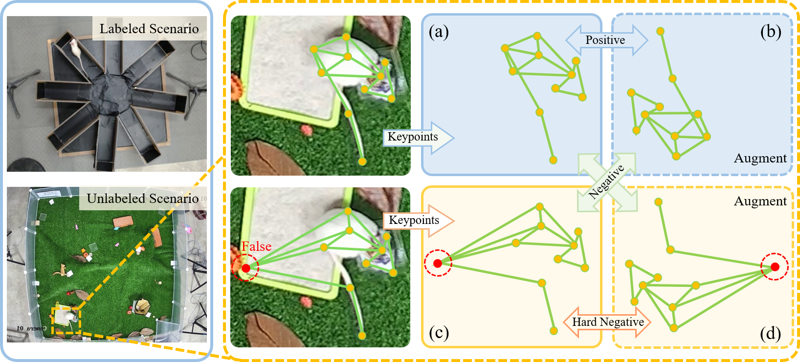

# GC-UDAP

<div align="center">

<h1> GC-UDAP: Graph-Constraints based Unsupervised Domain Adaptation for Pose Estimation </h1>
Le Han<sup>1*</sup>, &nbsp;
 
 <sup>1</sup>[Zhejiang University](https://www.zju.edu.cn/english/), &nbsp;
 </div>
 <p align="center">
  
</p>
 
 ## 🚀 Overview
<p align="center">
  
</p>

## 📖 Description
To extend the model to the simulated scenario of unlabeled data, we propose a keypoint prediction method based on weakly supervised domain transfer.
1. A contrastive learning framework based on Transformer was constructed for pre-training, and the Source (providing Keypoints label) and Target (providing Center label) data features were learned.

2. The initial pseudo-labels were filtered from the Target data based on graph contrastive learning.

3. Domain Adaptation training is performed on the pre-trained pose estimation module according to the pseudo-labels, and the pseudo-labels are iteratively optimized during the training process. Besides, we design a Object-Specific Feature Align (OSFA) module to learn the related part, which is the object area, between the source and target domain.
   
4. A self-supervised training part based on graph contraintion is proposed to fully utilize the target domain data without pseudo-labels. 


## 🗓️ TODO
- [ Done] Contrastive learning based pre-training part 
<p align="center">
  
</p>

- [ Done] Pseudo-label underselection Module with Graph Contrastive Learning

- [ Done] Prepare datasets (Rat_Done, people_Done, TigDog_Done, AP-10K)

- [ Done] Transfer learning

- [ Done] Graph constraint
  
- [2023.12.30] Revise the paper

- [2024.1.5] Submit to IJCAI2024


## 🖼️ Results
QualitativeResults
<p align="center">
  
</p>

## 🎫 License

The content of this project itself is licensed under ...

## 🖊️ Citation


If you find this project useful in your research, please consider cite:


```BibTeX
