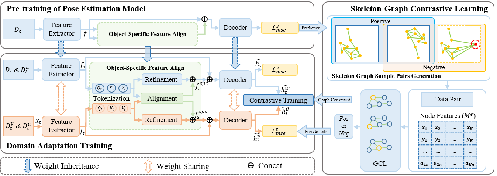
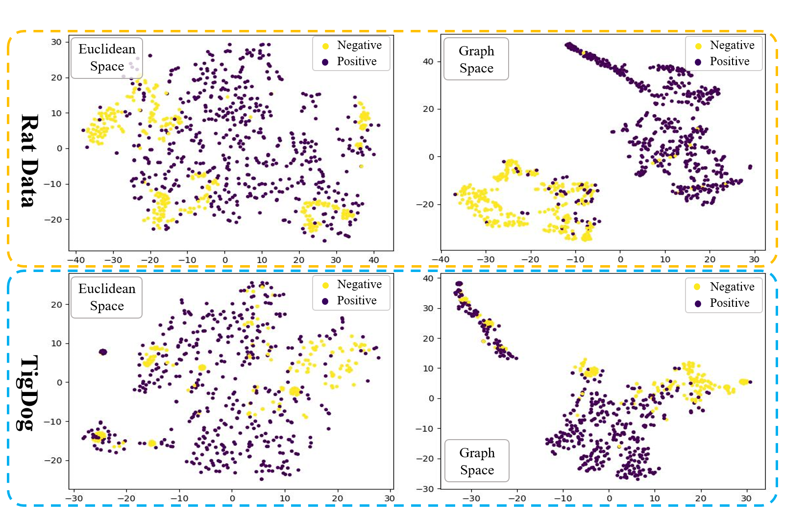

# GC-UDAP

<div align="center">

<h1> GC-UDAP: Graph Constraints based Unsupervised Domain Adaptation for Animal Pose Estimation </h1>
Le Han<sup>1*</sup>, &nbsp;
 
 <sup>1</sup>[Zhejiang University](https://www.zju.edu.cn/english/), &nbsp;
 </div>
 <p align="center">
  
</p>
 
 ## 🚀 Overview
<p align="center">
  
</p>

## 📖 Description
We propose an unsupervised domain adaptation model, named GC-UDAP, for animal pose estimation, leveraging skeleton graph constraints. This model addresses the challenges of performance degradation due to varying animal data scenes and the limited availability of labeled data.


## 🗓️ TODO
- [ Done] Pre-training of pose estimation model
- [ Done] Contrastive learning based pre-training part 
<p align="center">
  
</p>

- [ Done] Pseudo-label underselection Module with Graph Contrastive Learning

- [ Done] Prepare datasets (Rat_Done, TigDog_Done, AP-10K_Done)

- [ Done] Transfer learning

- [ Done] Graph constraint
  
- [Done] Revise the paper

- [Done] Submit to IJCAI2024

## 🖼️ Results
QualitativeResults
<p align="center">
  
</p>


## 💻 Useage


## 🎫 License

The content of this project itself is licensed under ...

## 🖊️ Citation


If you find this project useful in your research, please consider cite:


```BibTeX
